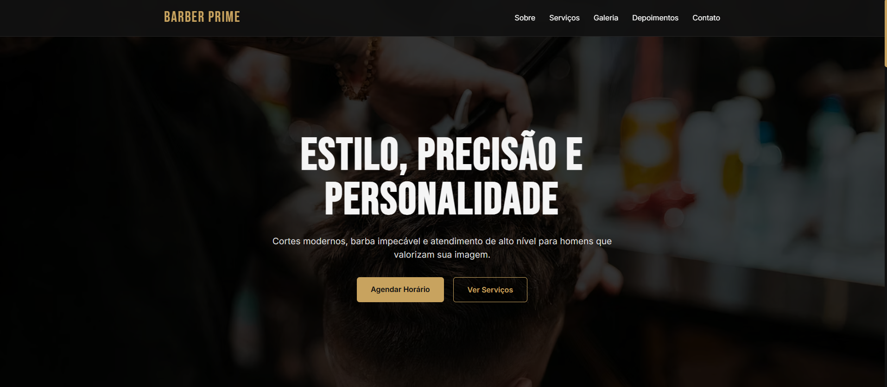

# Baber Prime

## Sobre o projeto
O Barber Prime é um site institucional desenvolvido para uma barbearia fictícia com foco em transmitir profissionalismo, sofisticação e confiança. O projeto foi pensado para apresentar os serviços, destacar a qualidade do atendimento e facilitar o agendamento de horários por meio do WhatsApp, oferecendo uma experiência moderna e intuitiva para os clientes.

## Preview

-- ou -- [Ver projeto ao vivo](https://dudamilannnn.github.io/site-barbearia-2026/)

## Tecnologias utilizadas
- HTML5
- CSS3 (Flexbox Grid e Media Queries)
- JavaScript (ES6+)
- Google Fonts (Bebas Neue e Inter)

## Funcionalidades
- Layout totalmente responsivo (mobile, tablet e desktop)
- Cabeçalho fixo durante a navegação
- Hero Section com chamada para ação
- Seção de apresentação da barbearia
- Catálogo de serviços com descrição, duração e faixa de preço
- Galeria de imagens
- Carrossel automático de depoimentos
- FAQ em formato de acordeão
- Formulário de agendamento
- Geração automática de mensagem para WhatsApp
- Botão flutuante de WhatsApp
- Botão "Voltar ao topo"
- Rolagem suave entre as seções da página


## O que aprendi / O que pratiquei
Neste projeto pratiquei a criação de uma landing page completa utilizando HTML, CSS e JavaScript puro, com foco em organização de código e responsividade. Também trabalhei com CSS Grid e Flexbox para construção do layout, manipulação do DOM para implementar o carrossel de depoimentos e o FAQ interativo, além da integração do formulário de agendamento com a API do WhatsApp para facilitar o contato entre cliente e barbearia.

## Como rodar localmente
1. Clone o respositório
```bash
git clone https://github.com/dudamilannnn/site-barbearia-2026
```
2. Abra o arquivo index.html no navegador

## Autora
Maria Eduarda Milan - Desenvolvedora Web